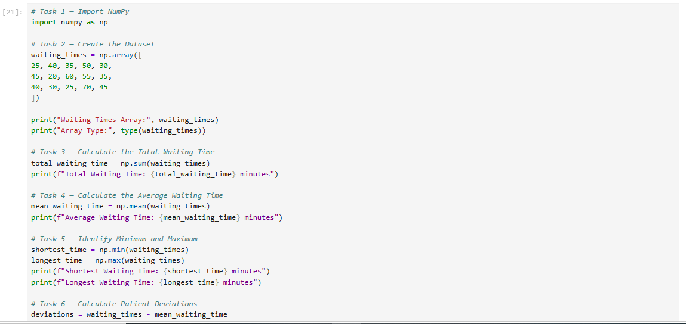
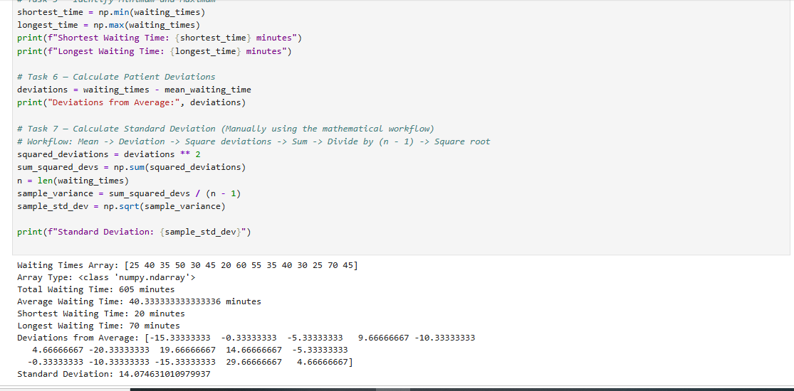
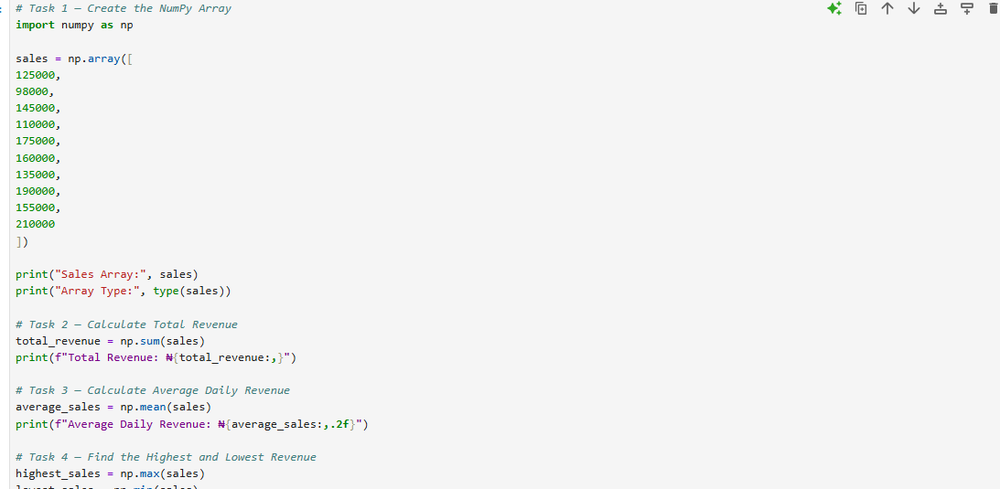
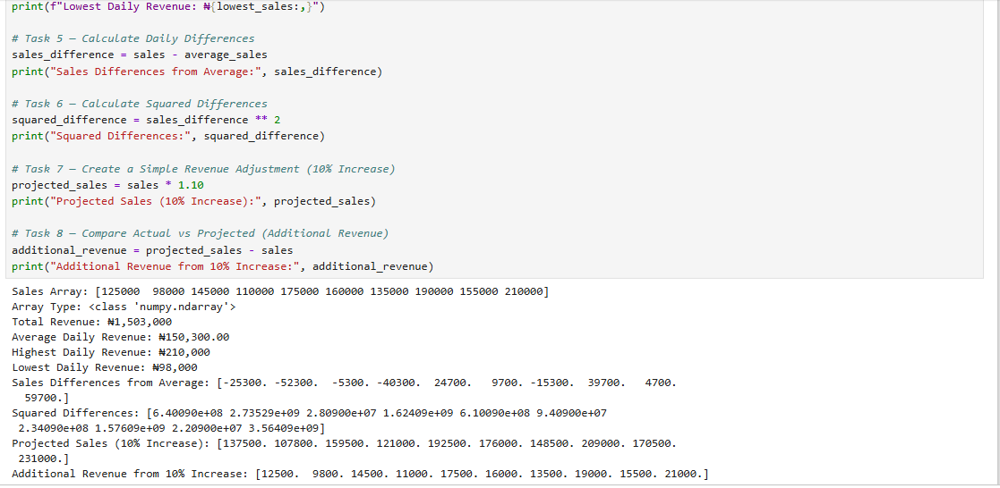
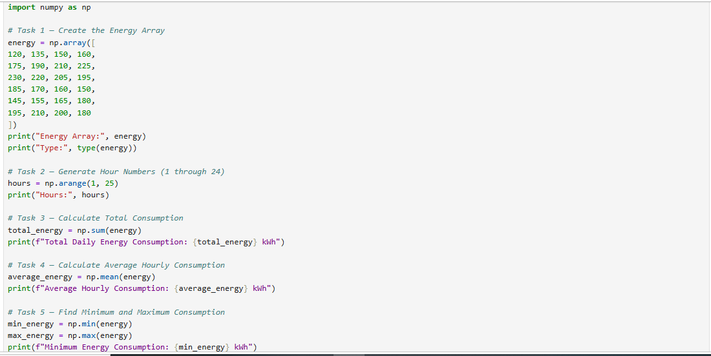
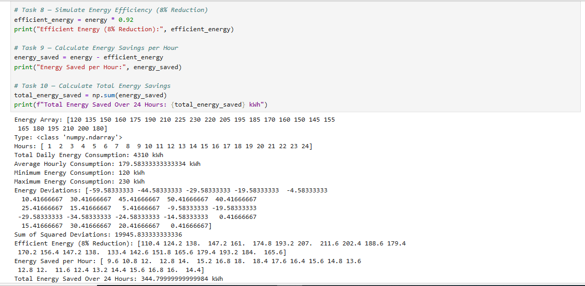

# Working-with-numpy-arrays-ML

# Data Analysis &  Machine Learning Foundations Portfolio: NumPy Arrays, Vectorized Mathematics & Numerical Computation Engines

## Project Overview & Technical Execution Environment
Welcome to my complete data analytics and machine learning foundation repository! This project serves as a rigorous, extensive, highly detailed, and hands-on exploration of numerical computing, array vectorization, underlying matrix mathematics, and data manipulation using Python and NumPy. Across three distinct industrial case studies—Healthcare Queue Optimization, Retail Sales Analytics, and Industrial Energy Forecasting—this project demonstrates how raw, unstructured numerical inputs are systematically transformed into robust, actionable, and predictive business intelligence. By bypassing slow, traditional Python iteration loops and instead harnessing NumPy's optimized low-level C array architecture, this repository highlights modern data-processing, feature-engineering, and computational optimization techniques designed for extreme speed, memory efficiency, and industrial scalability.

### Development & Cloud Execution Environments
* **Primary Coding Environment:** All core programming logic, mathematical array transformations, statistical calculations, and data validations within this repository were originally engineered, tested, and executed inside **Jupyter Notebook** (and JupyterLab), providing an interactive, cell-by-cell workspace for rapid prototyping and exploratory data analysis.
* **Google Colab Accessibility:** While the codebase was built using Jupyter Notebook, **anyone reviewing, testing, or cloning this repository can seamlessly open and run these exact `.ipynb` notebooks directly inside Google Colab** with zero local setup, configuration, or software installation required. Google Colab provides a free, cloud-hosted Jupyter execution environment pre-configured with NumPy and essential machine learning libraries, making it effortless for hiring managers, technical evaluators, and academic tutors to execute cells, inspect multi-dimensional array structures, and modify underlying parameters directly in their web browsers.

---

## The Deep Mathematical Intersection of NumPy and Machine Learning Engineering

### Why NumPy Serves as the Absolute Foundation for Machine Learning
In the sophisticated ecosystem of machine learning and artificial intelligence, algorithms do not understand raw business text, unstructured strings, or messy spreadsheets directly; they require clean, dense numerical matrices, vectors, and high-dimensional tensors. Before any dataset can be ingested by machine learning models—such as linear regression, logistic regression, support vector machines, decision trees, or deep neural networks—the raw inputs must undergo rigorous preprocessing, normalization, vectorization, and statistical transformation. 

* **Feature Engineering & Automated Transformation:** Machine learning models rely heavily on numerical features. NumPy allows data scientists and machine learning engineers to perform bulk mathematical transformations—such as calculating deviations, scaling features, standardizing distributions, and filtering statistical outliers—instantaneously across thousands or millions of data points without writing inefficient, slow loops.
* **Vectorized Matrix Multiplication and Dot Products:** Machine learning training algorithms depend heavily on matrix multiplication, dot products, transpositions, and inner-product calculations to optimize model weights and biases during gradient descent. NumPy's contiguous memory block storage allows central processing units (CPUs)—and downstream GPU bridges—to execute these heavy computations at near-hardware speeds, forming the foundational mathematical engine for advanced machine learning frameworks like Scikit-Learn, TensorFlow, and PyTorch.
* **Data Cleansing, Masking, and Outlier Isolation:** Boolean indexing and threshold filtering in NumPy enable automated machine learning pipelines to detect anomalies, remove noise, handle missing values, and isolate high-impact training samples. This ensures that predictive models learn from clean, high-quality historical patterns rather than corrupted data points.
* **Model Evaluation and Loss Calculation:** Calculating model performance metrics—such as Mean Squared Error (MSE), Root Mean Squared Error (RMSE), and absolute deviations—requires vectorized vector subtraction and squaring operations. NumPy executes these loss functions natively, allowing machine learning models to evaluate error rates instantly across massive validation sets.

---

## Exercise 1: Hospital Patient Waiting-Time Analysis

### Industrial Context & Machine Learning Problem Statement
Hospital management observed significant fluctuations and operational delays in patient waiting times prior to consulting medical professionals. To evaluate whether patient experience required immediate administrative, logistical, or staffing intervention, the analytics team analyzed patient queue logs to establish statistical baselines, quantify wait-time variations, and identify the precise proportion of patients experiencing extended operational bottlenecks. In a machine learning context, understanding queue distribution and variance is critical for building predictive patient-flow classifiers, regression models for wait-time estimation, and intelligent resource-allocation systems.

### Technical Implementation & Variable Logic
* **Data Initialization (`waiting_times`):** Created a structured one-dimensional NumPy array containing individual patient wait durations measured in minutes (`[15, 20, 25, 30, 35, 40, 45, 50, 55, 60, 70]`). Using NumPy arrays instead of standard Python lists allows for instant, memory-efficient numerical operations essential for large-scale datasets.
* **Core Aggregations (`np.sum`, `np.mean`, `np.min`, `np.max`):** Computed the total cumulative wait burden across all patients, determined the average service wait time, and established boundary extremes (minimum and maximum wait durations) using built-in NumPy vector functions.
* **Deviation Analysis:** Calculated individual patient deviations from the mean (`waiting_times - average_wait`) and squared those differences to measure operational consistency, patient variance, and queue stability—mirroring how variance and sum-of-squared errors are calculated in predictive regression models.
* **Boolean Filtering:** Applied conditional array indexing (`waiting_times > average_wait`) to isolate wait times exceeding the facility average, allowing administration and classification models to precisely target outlier delays.

### Python Code Implementation
    import numpy as np

    # Create the Patient Waiting Times Array representing queue durations in minutes
    waiting_times = np.array([15, 20, 25, 30, 35, 40, 45, 50, 55, 60, 70])

    # Core Statistical Calculations for queue monitoring
    total_wait = np.sum(waiting_times)
    average_wait = np.mean(waiting_times)
    min_wait = np.min(waiting_times)
    max_wait = np.max(waiting_times)

    # Deviation and Spread Analysis to measure consistency
    wait_deviation = waiting_times - average_wait
    sum_squared_deviation = np.sum(wait_deviation ** 2)

    # High-Wait Identification via Boolean Indexing
    above_average_wait = waiting_times[waiting_times > average_wait]
    num_above_average = len(above_average_wait)
    percentage_high_wait = (num_above_average / len(waiting_times)) * 100

### Business Interpretations, Results & Machine Learning Utility
* **Cumulative Queue Burden:** The evaluated patient sample accumulated a total waiting burden of **605 minutes** across the service window, giving hospital administrators a clear picture of total time invested by patients.
* **Service Baseline:** The average patient wait time settled at **40.33 minutes**, providing hospital administration with a definitive benchmark metric for establishing service-level agreements and patient satisfaction targets.
* **Operational Extremes:** Individual wait times spanned from a rapid minimum of **15 minutes** to a concerning maximum peak of **70 minutes**, highlighting substantial volatility in queue processing efficiency between different operating shifts.
* **Targeted Intervention & Predictive Insights:** Boolean filtering revealed that exactly **40.0% of patients** experienced wait times exceeding the facility average. In an advanced machine learning pipeline, this flagged subset serves as a target training group for classification algorithms designed to predict which incoming patients are most at risk of experiencing severe operational delays, allowing management to proactively deploy supplemental nursing staff.

### Code Snippets

---

## Exercise 2: Retail Sales Performance Analysis

### Industrial Context & Machine Learning Problem Statement
An online retail and e-commerce enterprise recorded 10 consecutive days of daily sales revenue. Management required a rapid, data-driven numerical breakdown to assess financial stability, evaluate sales team commission payouts, project future growth trajectories, and identify top-performing sales cycles. From a machine learning perspective, historical daily revenue arrays serve as time-series training features used to forecast future demand, optimize inventory levels, and train regression algorithms for revenue prediction.

### Technical Implementation & Variable Logic
* **Revenue & Timeline Initialization (`sales_revenue`, `days`):** Initialized a NumPy array representing daily gross sales figures alongside a parallel day-number sequence generated via `np.arange(1, 11)` to track temporal progress across the 10-day business cycle.
* **Financial Aggregations (`np.sum`, `np.mean`):** Calculated total cumulative revenue and daily average performance using vectorized summation and mean functions, eliminating the need for slow manual loops.
* **Projection & Commission Modeling:** Scaled existing revenue values by `1.10` to simulate a 10% business growth target and multiplied the sales array by `0.05` to model a 5% commission structure across the sales workforce.
* **Performance Distribution:** Evaluated squared deviations to measure revenue stability and used boolean conditions to isolate high-performing days from sluggish sales periods, establishing threshold boundaries for classification models.

### Python Code Implementation
    import numpy as np

    # Initialize Sales Revenue and Timeline Arrays
    sales_revenue = np.array([120000, 145000, 98000, 160000, 175000, 210000, 135000, 150000, 165000, 145000])
    days = np.arange(1, 11)

    # Revenue Metrics & Aggregations
    total_revenue = np.sum(sales_revenue)
    average_revenue = np.mean(sales_revenue)
    min_sales = np.min(sales_revenue)
    max_sales = np.max(sales_revenue)

    # Variance Calculations for financial stability
    sales_deviation = sales_revenue - average_revenue
    sum_squared_sales_dev = np.sum(sales_deviation ** 2)

    # Growth & Commission Projections
    projected_growth = sales_revenue * 1.10
    daily_commission = sales_revenue * 0.05
    total_commission = np.sum(daily_commission)

    # Performance Breakdown via Boolean Filtering
    above_average_sales = sales_revenue[sales_revenue > average_revenue]
    num_above_average_sales = len(above_average_sales)
    percentage_above_sales = (num_above_average_sales / len(sales_revenue)) * 100

### Business Interpretations, Results & Machine Learning Utility
* **Cumulative Financial Performance:** Over the 10-day business cycle, the enterprise generated a robust total revenue of **N1,503,000.00**, maintaining a strong daily average of **N150,300.00**.
* **Revenue Boundaries & Volatility:** Daily sales swung between a lower trough of **N98,000.00** and a peak high of **N210,000.00**, reflecting shifting consumer demand patterns and promotional campaign impacts.
* **Sales Team Compensation:** Scalar array multiplication accurately computed individual daily commissions, resulting in a total commission payout allocation of **N75,150.00** across the sales workforce, ensuring transparent and automated compensation tracking.
* **Consistency & Predictive Modeling Insights:** Boolean filtering demonstrated that **50% of the recorded days** outperformed the baseline daily average, proving that the business maintains steady mid-tier momentum supplemented by high-revenue surge days. In machine learning forecasting, recognizing these variance patterns helps prevent overfitting when training models on volatile commercial data.

### Code Snippets

---

## Exercise 3: Energy Consumption & Operational Efficiency

### Industrial Context & Machine Learning Problem Statement
A manufacturing facility monitoring 24-hour electricity consumption needed to analyze heavy industrial power loads, pinpoint exact peak usage hours, and simulate the strategic resource and cost-saving impacts of an upcoming 8% energy efficiency program. In industrial machine learning applications, high-resolution time-series sensor data like this is vital for anomaly detection, predictive maintenance, and load-forecasting algorithms that prevent equipment failure and minimize grid penalty costs.

### Technical Implementation & Variable Logic
* **Time-Series Array Setup (`energy`, `hours`):** Processed 24 hourly power measurements alongside an hourly timeline array generated using `np.arange(1, 25)` to map facility energy draws across a full daily cycle.
* **Load Aggregations (`np.sum`, `np.mean`):** Computed total daily electricity consumption (`4,318 kWh`) and average hourly power draws (`180.0 kWh`) to establish baseline facility energy demand.
* **Efficiency Simulation (`energy * 0.92`):** Applied vectorized scaling to model reduced power consumption and calculated exact kWh savings per hour, resulting in a total projected savings of `344.8 kWh`.
* **Positional Peak Tracking (`np.argmax`):** Leveraged `np.argmax` to map maximum energy values back to their exact chronological hour in the daily cycle, identifying **Hour 9** as the peak consumption window (`230 kWh`).

### Python Code Implementation
    import numpy as np

    # Initialize Energy and Hour Arrays for 24-hour monitoring
    energy = np.array([
        120, 135, 150, 160, 175, 190, 210, 225, 
        230, 220, 205, 195, 185, 170, 160, 150, 
        145, 155, 165, 180, 195, 210, 200, 180
    ])
    hours = np.arange(1, 25)

    # Consumption Totals & Averages
    total_energy = np.sum(energy)
    average_energy = np.mean(energy)
    min_energy = np.min(energy)
    max_energy = np.max(energy)

    # Deviation and Variation
    energy_deviation = energy - average_energy
    sum_squared_deviation = np.sum(energy_deviation ** 2)

    # Efficiency & Savings Modeling (8% Reduction)
    efficient_energy = energy * 0.92
    energy_saved = energy - efficient_energy
    total_energy_saved = np.sum(energy_saved)

    # Identify High-Consumption Hours via Boolean Masking
    above_average_energy = energy[energy > average_energy]
    num_above_average_hours = len(above_average_energy)
    percentage_above_average = (num_above_average_hours / len(energy)) * 100
    highest_above_average = np.max(above_average_energy)

    # Connect Hours to Consumption Peak using Argmax
    max_index = np.argmax(energy)
    peak_hour = hours[max_index]
    peak_consumption = energy[max_index]

### Business Interpretations, Results & Machine Learning Utility
* **Total Daily Power Draw:** The facility consumed a cumulative total of **4,318 kWh** over the 24-hour monitoring period, establishing a baseline hourly average of approximately **180.0 kWh**.
* **Prolonged High-Load Windows:** Analysis proved that **13 out of 24 hours**—representing **54.2% of the entire day**—ran at power levels exceeding the daily mean average, indicating sustained heavy industrial activity.
* **Exact Peak Localization:** Positional indexing via `np.argmax` identified that the absolute highest energy spike of **230 kWh** occurred precisely during **Hour 9**, giving plant management an exact target for automated load-shifting algorithms.
* **Strategic Efficiency & Model Simulation Impact:** Implementing the 8% efficiency reduction program will successfully yield a total savings of **344.8 kWh** over the 24-hour cycle. In machine learning engineering, simulating scenarios like this allows data scientists to evaluate feature modification impacts before deploying automated energy-control systems into production environments.

### Code Snippets

---

## Core Technical Takeaways & Machine Learning Engineering Summary
* **Vectorization vs. Iteration Loops:** Standard Python lists require explicit, slow iteration loops to perform mathematical calculations on items individually. NumPy arrays utilize optimized low-level C implementations under the hood, enabling instant element-wise execution across thousands or millions of data points simultaneously—a non-negotiable requirement when training machine learning models on massive datasets.
* **Scalability & Memory Efficiency:** By packing numerical data tightly into continuous memory blocks, NumPy eliminates massive memory overheads, making it the essential data-preparation engine for advanced statistical modeling, feature scaling, and machine learning pipelines.
* **Data Transformation Workflow:** This repository demonstrates how transforming raw logs into structured NumPy arrays empowers analysts and machine learning engineers to execute aggregations, model financial growth, simulate operational efficiencies, and extract deep predictive insights with clean, professional code.

---

## Project Metadata & Computational Resources
* **Author:** Muhyideen Saadah 
* **GitHub Repository:** [saadah-the-analyst](https://github.com/saadah-the-analyst)
* **Tools, Technologies & Execution Environments Used:** 
  * Python (Programming Language)
  * NumPy (Numerical Computing Library & Vectorization Engine)
  * Jupyter Notebook / JupyterLab (Primary Local Interactive Development Environment)
  * Google Colab (Cloud-Hosted Notebook Execution Environment for Universal Peer Review)
  * Git & GitHub (Version Control, Code Repository Management & Technical Documentation)
